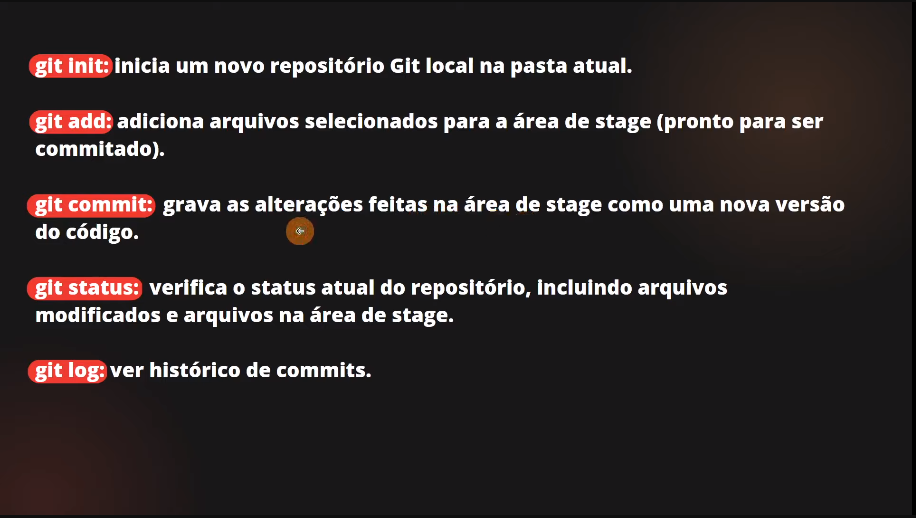
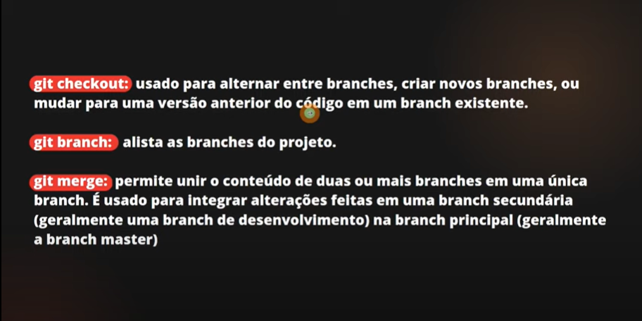
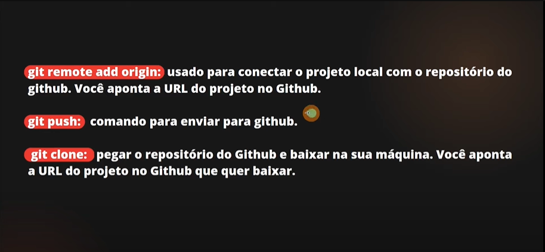

# Documentação Git #

---

 > 🟢 Comandos Básicos do Git 🟢

---

 git init | git add . | git commit | git status | git log

 1. ```git Init``` : Ele inicializa um repositório vásio ao seu projeto na pasta atual;
 2. ```git add .``` : Adiciona os arquívos selecionados para a área de stage(Pronto para Comitar);
 3. ```git Commit``` : Grava as alterações feitas na área de stage como uma nova versão do código;
 4. ```git Status``` : Verifica o status atual do repositório, incluindo arquivos modificados na área de stage;
 5. git log : Ver histórico de commits;

---



---

 > 🟠 Gerenciamento de Versões 🟠

---

 git checkout | git branch | git merge

1. ```git checkout``` : usado para alternar entre branches, criar novas branches, ou mudar para uma versão anterior do código em uma branch existente;
2. ```git branch``` : alitas as branches do projeto;
3. ```git merg``` : permite unir o conteúdo de duas ou mais branchesem uma unica branch. É usado para integrar alterações feitas em uma branch secundária (geralmenteuma branch de desenvolvimento) na branch principal (geralmentea branch master);

---



---

 > 🟣 Colaboração com o GITHUB 🟣

---

 git remote add origin | git push | git clone

  1. ```git remote add origin "nome da branch que quer enviar"``` : usado para conectar o projeto ```Local``` com o repositório do ```GITHUB```. Você aponta a ```URL``` do repositório do GITHUB;
  2. ```git push``` : comando para enviar o projeto para o repositório remoto do github;
  3. ```git clone``` : pegar o repositório do GitHube baixar na sua máquina. Você aponta a ```URL``` do projeto no GitHub que quer baixar;

  ---



  ---

  ```Espero que ajude em seus estudos também se ouver algo a ser modificado, me mande um pull request, caso ainda não saiba como fazer isso entre em contato comigo pelo seguinte email, gabrielestudie2@gmail.com```
